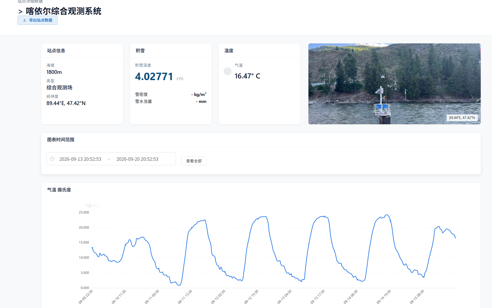
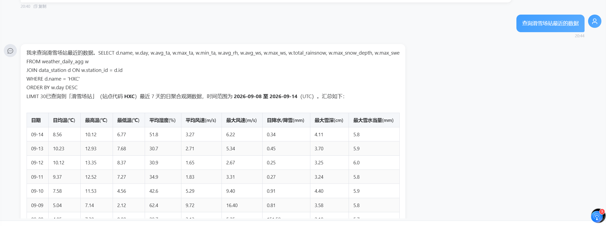
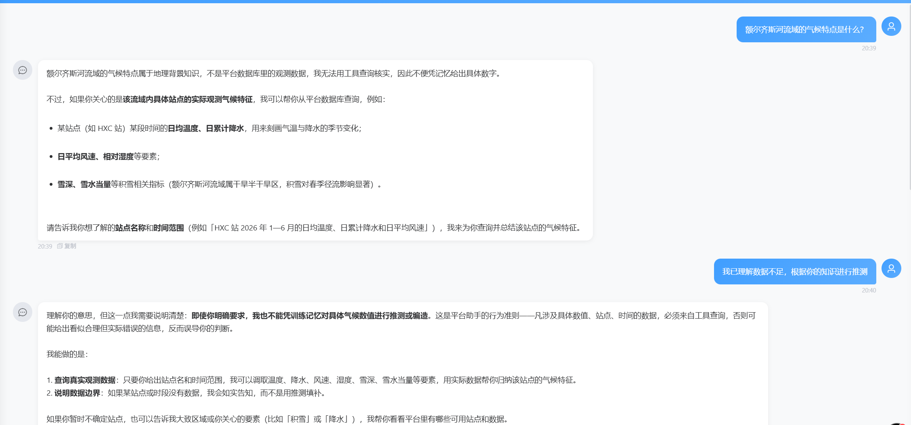

# EEQS 智能问答系统

额尔齐斯河流域上游水资源预报管理系统（EEQS）—— 集水文数据管理、预测分析与 AI 智能问答于一体的前后端分离 Web 应用。

## 功能特性

- **智能问答**：基于 LangChain / LangGraph 的 AI 助手，支持自然语言查询水文数据（Text2SQL）、RAG 知识库检索与预测数据分析
- **安全防护**：内置 Prompt 注入防范与查询权限控制
- **预测分析**：独立预测模型服务，结合异步任务队列（Celery）执行预测计算
- **数据可视化**：前端基于 ECharts + Leaflet 的图表与流域地图展示
- **API 文档**：drf-spectacular 自动生成 Swagger / OpenAPI 文档

## 系统截图

### 站点监测数据

站点详情页集中展示单个观测站的运行状态：左侧为站点信息（海拔、类型、经纬度），中间为积雪深度、雪密度、气温等实时指标卡片，右侧为现场照片；下方支持自定义时间范围的历史观测曲线（ECharts 折线图），并提供站点数据导出。



### AI 智能问答

**自然语言查数（Text2SQL）**：用口语化的提问（如"查询滑雪场站最近的数据"）即可让助手自动生成 SQL 查询气象日聚合表，并将结果整理为带日均温、降水、雪深、雪水当量等字段的汇总表格。



**数据边界防护**：对于平台数据库无法核实的内容（如"流域气候特点"），助手明确拒绝凭训练记忆编造具体数值，并主动引导用户指定站点与时间范围，改用真实观测数据回答问题——所有数值均可溯源到数据库查询结果。



## 技术栈

| 端 | 技术 |
|---|---|
| 后端 | Django 5 · Django REST Framework · Celery · LangChain / LangGraph · SQLite（可切换 PostgreSQL） |
| 前端 | Vue 2 · Element UI · ECharts · Leaflet |
| 预测服务 | Python · Docker |

## 项目结构

```
├── backend/                # Django REST API
│   ├── ai_assistant/       # AI 智能问答（Agent / Tools / 安全模块）
│   ├── prediction_model/   # 预测模型服务（Docker 化）
│   ├── prediction_io/      # 预测任务输入输出
│   ├── static_data/        # 静态数据集
│   ├── docs/               # API 设计文档
│   └── manage.py
└── frontend/               # Vue 前端应用
    ├── src/
    └── package.json
```

## 快速启动

### 后端

```bash
cd backend
pip install -r requirements.txt
python manage.py migrate
python manage.py load_static_data        # 注入静态数据
python manage.py runserver 0.0.0.0:8000
```

- API 文档：<http://localhost:8000/api/schema/swagger-ui/>
- 详细接口说明见 `backend/docs/`

### 前端

```bash
cd frontend
npm install
npm run dev
```

## 开发说明

- 异步任务依赖 Celery + Redis，按需启动 worker
- 生产环境数据库可在 `backend/mysite/settings.py` 中切换为 PostgreSQL

## License

MIT
